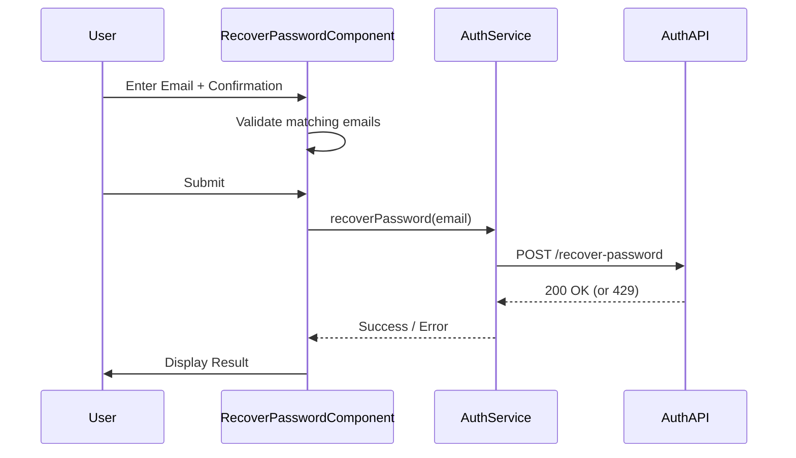
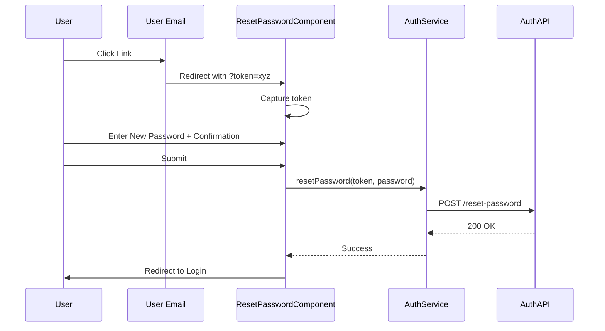

# Design: Password Recovery Feature

## Technical Approach
We will extend the `AuthService` to include recovery logic and create two standalone Angular components for the recovery request and password reset UI. These components will follow the existing design system used in `LoginComponent`.

## Architecture Decisions

### Decision: State Management for Recovery Flow
**Choice**: Use `ReactiveFormsModule` local state.
**Alternatives considered**: NgRx or other state management.
**Rationale**: The recovery flow is simple and localized. Adding global state management for a two-step form is overkill. Reactive forms provide excellent validation and state tracking.

### Decision: Rate Limiting Enforcement
**Choice**: Enforcement ONLY on Backend, with Frontend indicator.
**Alternatives considered**: Client-side IP tracking.
**Rationale**: Client-side IP tracking is unreliable and can be bypassed. The requirement is a security measure, so it must be handled by the server. The frontend will merely display the 429 error and an optional countdown based on the server's lockout time.

## Data Flow

### Sequence Diagram: Request Recovery


### Sequence Diagram: Reset Password


## File Changes

| File | Action | Description |
|------|--------|-------------|
| `src/app/app.routes.ts` | Modify | Add `/auth/recover-password` and `/auth/reset-password` routes. |
| `src/app/core/auth/auth.service.ts` | Modify | Add `recoverPassword` and `resetPassword` methods. |
| `src/app/features/auth/pages/recover-password.component.ts` | Create | Component logic for requesting recovery link. |
| `src/app/features/auth/pages/recover-password.component.html` | Create | Template for recovery request form. |
| `src/app/features/auth/pages/reset-password.component.ts` | Create | Component logic for setting new password. |
| `src/app/features/auth/pages/reset-password.component.html` | Create | Template for new password form. |

## Interfaces / Contracts

### AuthService Additions
```typescript
interface RecoverPasswordReq {
  email: string;
}

interface ResetPasswordReq {
  token: string;
  passwordNew: string;
}

// In AuthService class
recoverPassword(email: string): Observable<void>;
resetPassword(token: string, passwordNew: string): Observable<void>;
```

## Testing Strategy

| Layer | What to Test | Approach |
|-------|-------------|----------|
| Unit | Validation Logic | Test that email matching and password length validators work correctly in components. |
| Unit | Service Integration | Use `HttpClientTestingModule` to verify `AuthService` sends correct JSON to endpoints. |
| E2E | Recovery Flow | Manual verification of navigating from login -> recover -> reset. |

## Migration / Rollout
No migration required. This is a purely additive feature.

## Open Questions
- Should the "Forgot Password" link be added to the registration page too, or only the login page? (Assuming Login only for now).
- Does the backend require the confirmation email to be sent in the payload, or just verified on the frontend? (Assuming Frontend verification only).
